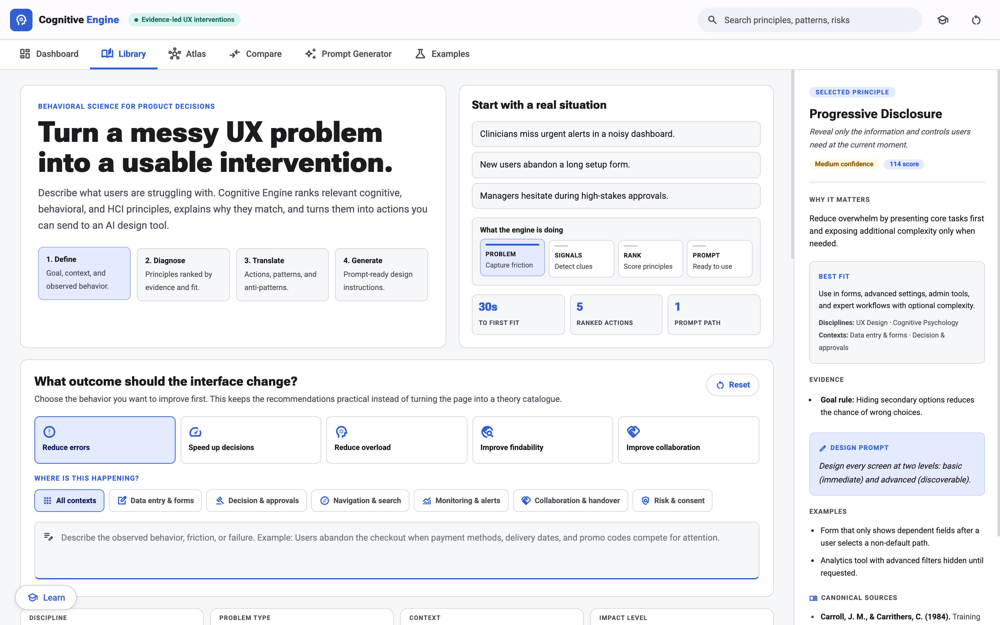
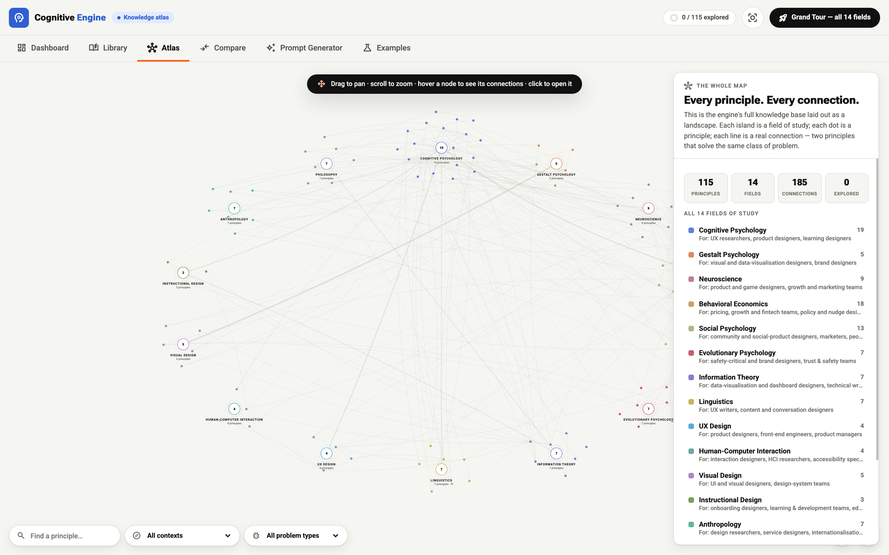

# Cognitive Engine

**Evidence-led UX interventions.** Describe your design problem in plain language and get the cognitive and behavioural science principles most likely to fix it — ranked, cited, and ready to paste into a design brief.

**Live site → https://tropicgirlie.github.io/cognitive-engine/**



## What's inside

- **Library** — 115 principles across 14 fields of study (cognitive psychology, behavioural economics, neuroscience, gestalt, HCI, and more), ranked for your problem with canonical sources for every claim.
- **Cognitive Atlas** — the full knowledge base laid out as an interactive map. Each island is a field of study, each dot a principle, each line a real connection between principles that solve the same class of problem. Includes a guided Grand Tour, professions per field, and deep links (`?disc=`, `?p=`).



- **Compare Mode** — put two principles side by side: evidence, strength, when to use each, and how they interact. Shareable via `?p=` deep links.
- **Case Files** — worked examples showing principles applied to real product problems.
- **Prompt Studio** — turn selected principles into a ready-to-use prompt for your design or AI workflow.
- **Guided tours** — first-run onboarding plus per-page tours.

## Tech

Dependency-free static HTML/JS/JSON. No build step, no framework, no tracking.

## Local development

```bash
npm run dev   # node scripts/dev-server.mjs — default http://localhost:7100
```

## Testing

```bash
npm run check # 28 static checks
```

CI (GitHub Actions) additionally runs the headless browser suites — `scripts/kbd-test.py` (keyboard/accessibility) and `scripts/e2e-journey.py` (full user journey) — via Chrome DevTools Protocol on every push.

## Deployment

The site auto-deploys to GitHub Pages from `main` on every push.
